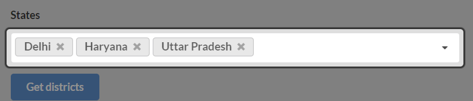
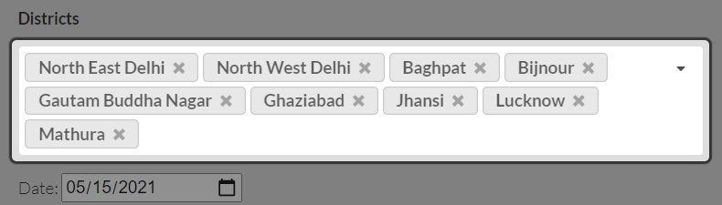
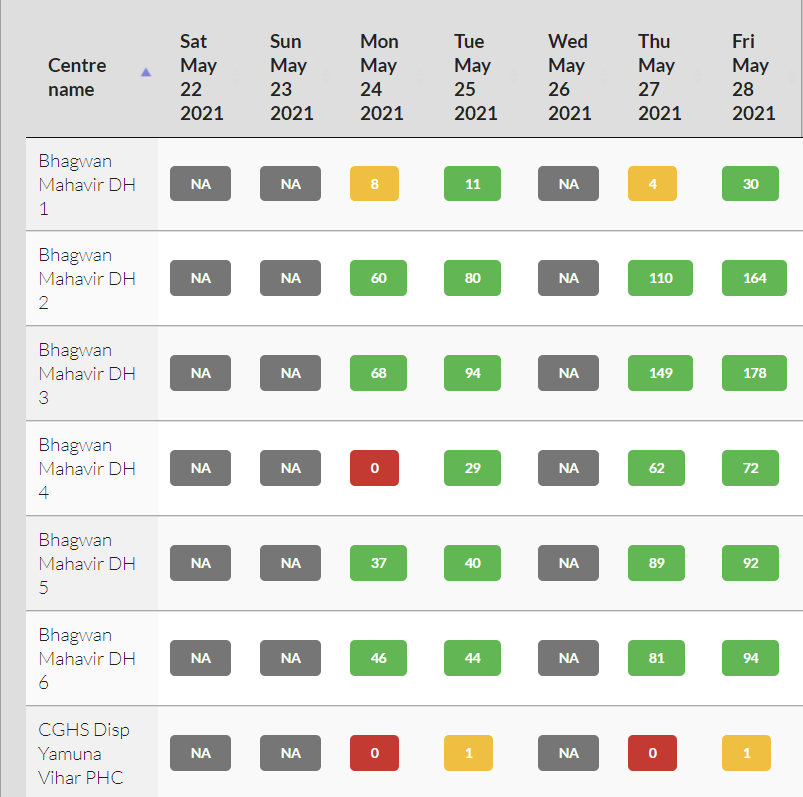
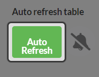
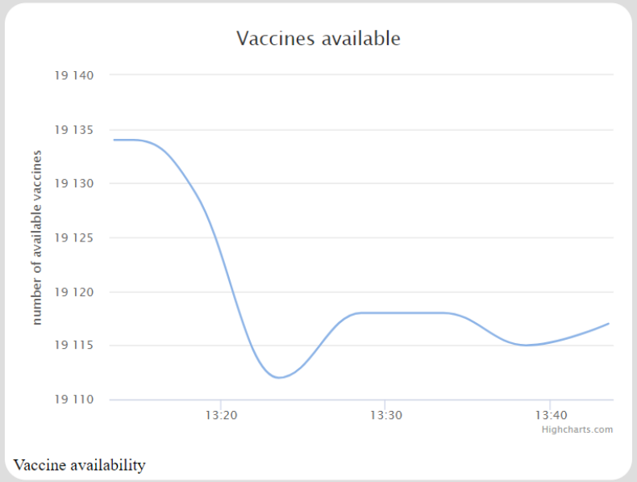
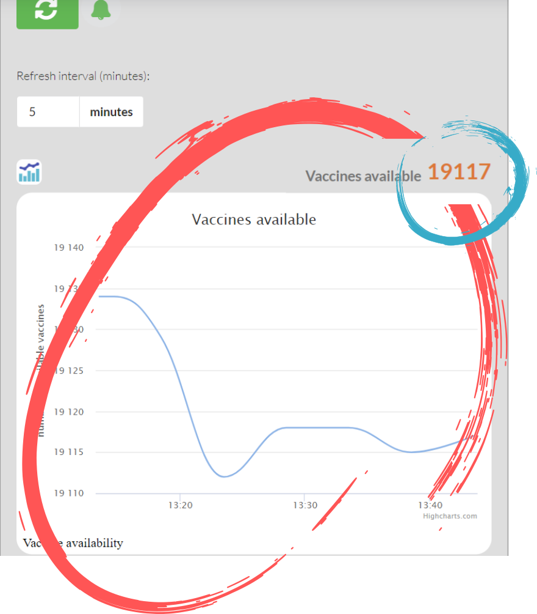
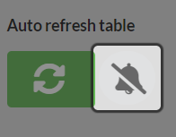
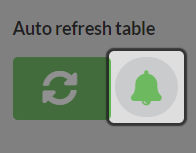

- [Looking for contributors !!!](#looking-for-contributors-)
    - [UX, QA, Dev, Misc](#ux-qa-dev-misc)
  - [Use this website to find free vaccine slots, Set alarms](#use-this-website-to-find-free-vaccine-slots-set-alarms)
    - [Search across multiple districts (and states) at once](#search-across-multiple-districts-and-states-at-once)
    - [Sort data (Highest number of available vaccines on top)](#sort-data-highest-number-of-available-vaccines-on-top)
    - [Filter results](#filter-results)
    - [Monitor vaccine availability continuously (Auto refresh)](#monitor-vaccine-availability-continuously-auto-refresh)
    - [View availability statistics](#view-availability-statistics)
    - [Set audio alarm/ Receive notifications](#set-audio-alarm-receive-notifications)
    - [Disadvantages over Cowin](#disadvantages-over-cowin)
- [Development](#development)
  - [Building locally](#building-locally)
  - [Contributing](#contributing)
  - [Mock API](#mock-api)
- [Credits](#credits)

# Looking for contributors !!!
### UX, QA, Dev, Misc


## Use this website to find free vaccine slots, Set alarms


### Search across multiple districts (and states) at once
<!---->
<!---->


### Sort data (Highest number of available vaccines on top)
<!---->


### Filter results
<!---->


### Monitor vaccine availability continuously (Auto refresh)

<!---->
<!---->


### View availability statistics
<!---->
<!---->


### Set audio alarm/ Receive notifications
<!---->
<!---->
<!---->


<!--
### Advantages over Cowin
1. Auto book!
1. You can query across sevaral states, and districts at once. Eg. All vaccination centres in Delhi which have covishield available
1. You can be alerted when a vaccination slot becomes available.
1. You can sort data to quickly find centres with large number of free slots


-->

### Disadvantages over Cowin
~~1. Cannot be used to book slots. For that you will have to use Cowin, et al. (Work in progress? Please join as a contributor)~~

# Development
## Building locally
1. Clone this repo
2. Open git bash (search google for git bash to download)
3. run `bundle install`
4. run `jekyll serve`
5. The site will be available at `http://localhost:4000`

More info : [Building your site locally](https://docs.github.com/en/pages/setting-up-a-github-pages-site-with-jekyll/testing-your-github-pages-site-locally-with-jekyll#building-your-site-locally)

## Contributing
1. Fork this repo to you github profile
2. Make changes in your forked version of this repo. You can make as many commits as you want
3. Raise a pull request so that this repo will get notified about your changes, and your changes can be merged with this site.

## Mock API
Uisng mock API can help in testing. When mock API is in use the data is fetched from our ngrok API instead of cowin servers.

1. Enable usage of mock API
Open developer settings in chrome, and run the following funtion.
```
MockApi.IsMockEnabled()
```
2. Disable
```
MockApi.DisableMockApi()
```

# Credits
<a href="https://www.freepik.com/vectors/business">Business vector created by pikisuperstar - www.freepik.com</a>
