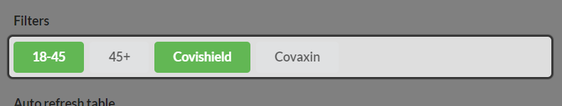

# Looking for contributors !!!
#### UX, QA, Dev, Misc

## Use this website to find free vaccine slots, Set alarms
### Search across multiple districts (and states) at once
<!---->
<!---->

#### Sort data (Highest number of available vaccines on top)
<!---->

#### Filter results
<!---->

#### Monitor vaccine availability continuously (Auto refresh)

<!---->
<!---->

#### View availability statistics
<!---->
<!---->

#### Set audio alarm/ Receive notifications
<!---->
<!---->
<!---->

<!--
### Advantages over Cowin
1. You can query across sevaral states, and districts at once. Eg. All vaccination centres in Delhi which have covishield available
1. You can be alerted when a vaccination slot becomes available.
1. You can sort data to quickly find centres with large number of free slots

-->

#### Disadvantages over Cowin
1. Cannot be used to book slots. For that you will have to use Cowin, et al. (Work in progress? Please join as a contributor)

#### Credits
<a href="https://www.freepik.com/vectors/business">Business vector created by pikisuperstar - www.freepik.com</a>